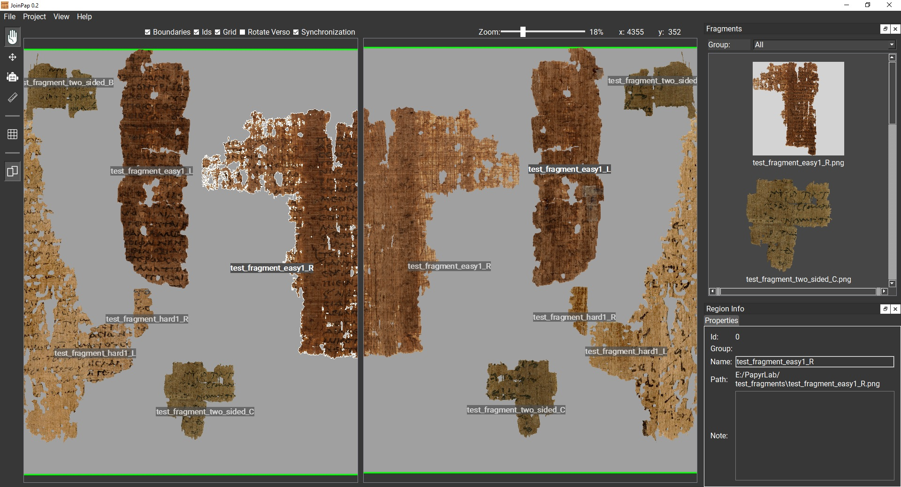

# JoinPap

JoinPap is a software tool developed within the PRIN PNRR 2022 project [Reconstructing Fragmentary Papyri through Human-Machine Interaction](https://www.joinpap.unifi.it/),
a joint effort between the Istituto Papirologico "Girolamo Vitelli" in Florence, and the Istituto di Scienza e Tecnologie dell'Informazione "A. Faedo" of the National Research Council (ISTI-CNR), Pisa.

The main goal of JoinPap is to support the experts in recomposing papyri fragments. The tool provides suggestions to the experts during the reconstruction process and exploits both the front and back visual information of the fragments to achieve robust results. The tool can be used also to document the papyri reconstruction work.

> **Note:** JoinPap is currently under development.

---

---

## Table of Contents

- [Requirements](#requirements)
- [Installation](#installation)
  - [Windows](#windows-binary)
  - [Linux](#linux-from-source)
  - [Running the Application](#running-the-application)
- [AI-based Fragment Matching Utility](#ai-based-fragment-matching)
- [Acknowledgements](#acknowledgements)
- [License](#license)

---

## Requirements

- [Python 3.8](https://www.python.org/downloads/release/python-3810/)
- [Git](https://git-scm.com/downloads)
- `pip` (included with Python 3.8)

---

## Installation

### Windows (binary)
A ready-to-run all-in-one version of the application can be found as a release here: [JoinPap v0.2](https://github.com/cnr-isti-vclab/JoinPap/releases/download/v0.2/JoinPap.exe)

### Windows (from source)

#### 1. Install Python 3.8

Download the Python 3.8 installer from the official website:
[https://www.python.org/downloads/release/python-3810/](https://www.python.org/downloads/release/python-3810/)

Run the installer and make sure to check **"Add Python 3.8 to PATH"** before clicking *Install Now*.

Verify the installation by opening a Command Prompt (`Win + R`, type `cmd`):

```cmd
python --version
```

#### 2. Install Git

Download and install Git from: [https://git-scm.com/download/win](https://git-scm.com/download/win)

#### 3. Clone the Repository

Open a Command Prompt or Git Bash and run:

```cmd
git clone https://github.com/cnr-isti-vclab/JoinPap.git
cd JoinPap
```

#### 4. Create and Activate a Virtual Environment

```cmd
python -m venv venv
venv\Scripts\activate
```

Your terminal prompt should now be prefixed with `(venv)`.

#### 5. Install Dependencies

```cmd
pip install --upgrade pip
python install.py
```

---

### Linux (from source)

#### 1. Install Python 3.8

On Ubuntu/Debian-based systems, Python 3.8 can be installed via `apt`:

```bash
sudo apt update
sudo apt install python3.8 python3.8-venv python3.8-dev -y
```

Verify the installation:

```bash
python3.8 --version
```

#### 2. Clone the Repository

```bash
git clone https://github.com/cnr-isti-vclab/JoinPap.git
cd JoinPap
```

#### 3. Create and Activate a Virtual Environment

```bash
python3.8 -m venv venv
source venv/bin/activate
```

Your terminal prompt should now be prefixed with `(venv)`.

#### 4. Install Dependencies

```bash
pip install --upgrade pip
pip install -r requirements.txt
```

---

### Running the Application

Once the virtual environment is active and dependencies are installed, start the application with:

```bash
python PapyrLab.py
```

> If you close the terminal and return later, remember to **re-activate the virtual environment** before running the app:
> - **Linux:** `source venv/bin/activate`
> - **Windows:** `venv\Scripts\activate`

---

## AI-based Fragment Matching
*Note: this is still an experimental tool*

JoinPap comes with early-version tools for finding matching fragments and proposing most-likely positionings between pairs of fragments.

These AI utilities make use of an external experimental tool, called [Papyrus Matching](https://github.com/mesnico/papyrus-matching) for analyzing fragment pairs and producing the files that can be then imported into JoinPap for analyzing the proposed matchings.

Please follow the README in Papyrus Matching for installing the tool and running analysis on a bundle of fragments.

## Acknowledgements

Thanks to all the people who are actively contributing to the development and the validation of JoinPap:

#### Istituto di Scienza e Tecnologie dell'Informazione (ISTI-CNR)
Fabio Carrara \
Massimiliano Corsini \
Fabrizio Falchi \
Nicola Messina

#### Istituto Papirologico Girolamo Vitelli (UNIFI)
Ilaria Cariddi \
Valentina Iannace \
Francesca Maltomini \
Giulia Mirante

## License

This project is licensed under the [GNU General Public License v3.0](LICENSE).
